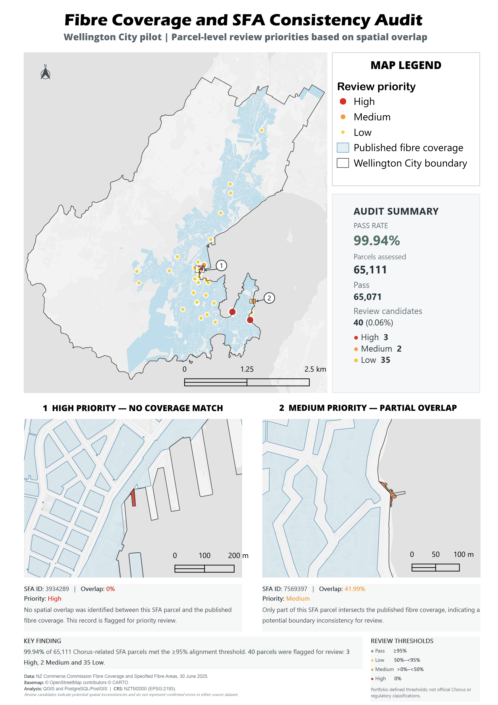
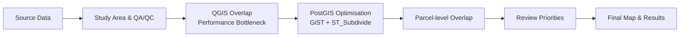
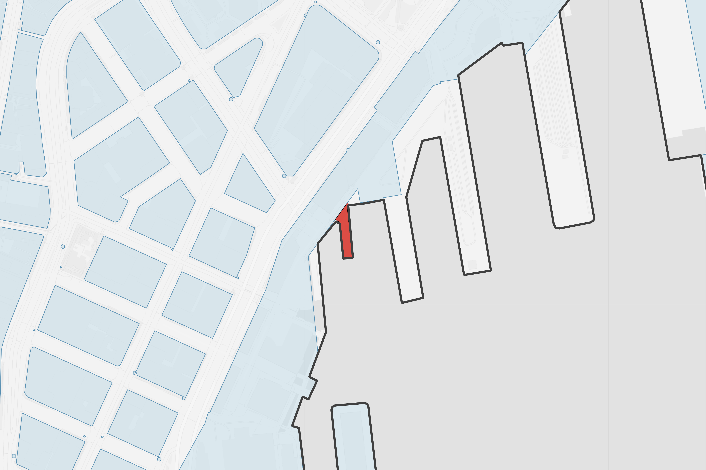
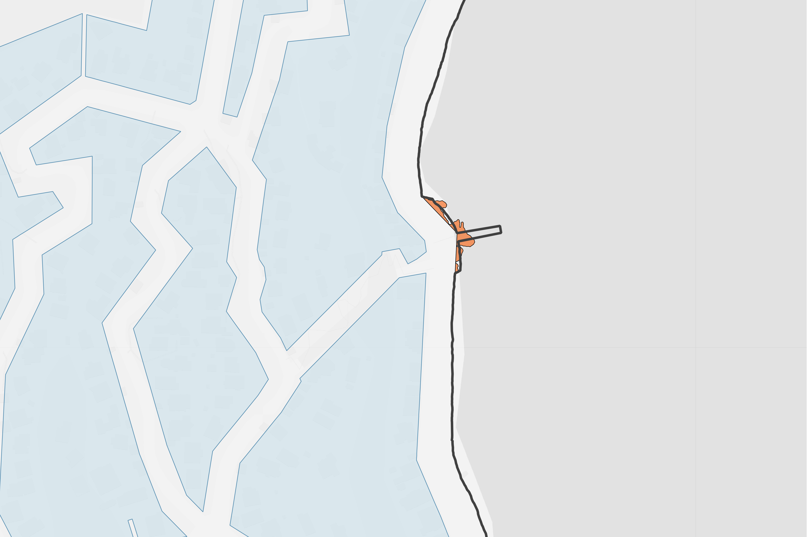

# Fibre Coverage & SFA Consistency Audit — Wellington Pilot
**Parcel-level spatial data quality audit using QGIS and PostgreSQL/PostGIS**

This project showcases a parcel-level **spatial data quality audit** using published [Fibre Coverage](https://www.comcom.govt.nz/regulated-industries/telecommunications/monitoring-the-telecommunications-market/telecommunications-connectivity-map/) and [Chorus-related Specified Fibre Area (SFA) parcels](https://www.comcom.govt.nz/regulated-industries/telecommunications/regulated-services/consumer-protections-for-copper-withdrawal/map-of-specified-fibre-areas/) in Wellington City. Using **QGIS** and **PostgreSQL/PostGIS**, the workflow combines **geometry validation**, **spatial database optimisation**, parcel-level **overlap analysis**, and **review-priority classification** to identify potential spatial inconsistencies between the two datasets.

## Final Output

The final map summarises parcel-level alignment between Chorus-related SFA parcels and published Fibre Coverage across Wellington City, highlighting **review candidates by priority**.

<p align="center">
  <a href="Fibre_SFA_Audit_Wellington_A4.png">
    
  </a>
</p>

<p align="center">
  <em>Click the map to view the full-resolution image.</em>
</p>

---

## What This Project Demonstrates

- Built an end-to-end spatial data quality workflow using **QGIS and PostgreSQL/PostGIS**, starting from a national SFA dataset of approximately **1.68 million parcel records**.
- Prepared and validated **65,623 Chorus-related SFA parcels** within the Wellington processing area, including CRS, geometry, and attribute quality checks.
- Detected and repaired an **invalid Fibre Coverage geometry** before downstream spatial processing.
- Moved parcel-level overlap analysis from QGIS to **PostGIS**, using **GiST spatial indexes** and **`ST_Subdivide`** to improve processing efficiency.
- Calculated parcel-level **overlap area and overlap percentage** and translated the results into operational **review priorities**.
- Assessed **65,111 parcels** within the Wellington City reporting boundary, with **99.94% meeting the ≥95% alignment threshold** and only **40 parcels identified for review**.
- Produced a final operational map combining citywide review priorities, summary metrics, and detailed review examples.

---

## Project Context

The New Zealand Commerce Commission publishes two relevant spatial datasets:

- **Fibre Coverage** — published geographic areas with fibre coverage.
- **Specified Fibre Areas (SFA)** — parcels formally recognised as being within a specified fibre service area.

The datasets serve different purposes and do not share a common identifier for a direct attribute join. A **spatial comparison** is therefore required.

> [!IMPORTANT]
> **Key question:** Do Chorus-related SFA parcels spatially align with the published Fibre Coverage?

Fibre Coverage represents connectivity data as at **30 June 2025**, while the 2025 SFA update is based on information provided by Chorus and local fibre companies as of **7 November 2025**. Spatial mismatches are therefore treated as **review candidates rather than confirmed source-data errors**.

> [!NOTE]
> **Portfolio project:** This is an independent GIS portfolio project developed for skills demonstration using publicly available data. It is not commissioned by, affiliated with, or endorsed by Chorus or the New Zealand Commerce Commission.

---

## Data

### Source Data

| Dataset | Source | Features | Role in the analysis |
|---|---|---:|---|
| [Fibre Coverage — 30 June 2025](https://www.comcom.govt.nz/regulated-industries/telecommunications/monitoring-the-telecommunications-market/telecommunications-connectivity-map/) | NZ Commerce Commission | **2,008** | Published fibre coverage extent |
| [Specified Fibre Areas (SFA) 2025](https://www.comcom.govt.nz/regulated-industries/telecommunications/regulated-services/consumer-protections-for-copper-withdrawal/map-of-specified-fibre-areas/) | NZ Commerce Commission | **1,683,966** | Parcel-level specified fibre area records |
| [Territorial Authority 2025](https://datafinder.stats.govt.nz/layer/120963-territorial-authority-2025/) | Stats NZ | — | Wellington City reporting boundary |

**Coordinate reference system:** NZGD2000 / New Zealand Transverse Mercator 2000 (**EPSG:2193**).

### Analysis Scope

The national datasets were reduced to a Wellington City pilot area for parcel-level analysis:

- **1,683,966** national SFA records in the source dataset.
- **65,623** Chorus-related SFA parcels retained within the buffered Wellington processing area.
- **65,111** parcels included in the final Wellington City reporting population.

A **500 m processing buffer** was used around Wellington City to avoid prematurely truncating parcels and coverage features near the reporting boundary. Final statistics were calculated using the Wellington City boundary.

<p align="center">
  <a href="Study Area and Processing Extent.png">
    
  </a>
</p>

<p align="center">
  <em>Wellington City reporting boundary and 500 m processing extent. Click the map to view the full-resolution image.</em>
</p>

---

## Method


### 1. Study-area preparation

The **Wellington City boundary** was used as the final reporting extent.

A **500 m processing buffer** was created around the city boundary so that parcels and coverage features close to the boundary were not prematurely truncated during intermediate processing.

SFA parcels were selected by spatial intersection rather than clipping, preserving their complete parcel geometries and original areas.

Fibre Coverage, which represents a continuous coverage surface rather than cadastral parcels, was clipped to the buffered processing extent to remove irrelevant geometry outside the study area.

---

### 2. Data quality checks

Before spatial comparison, the input datasets were checked for:

- CRS consistency
- null geometries
- geometry validity
- parcel identifiers
- geometry-derived parcel area
- consistency with source area attributes

During the initial QGIS spatial processing, **one invalid geometry was detected in the Fibre Coverage dataset**, which caused the spatial operation to fail. The geometry was repaired using the QGIS **Fix Geometries** tool before the coverage dataset was extracted and prepared for further analysis.

A GEOS geometry validity assessment was then performed on the **65,623 Chorus-related SFA parcels** in the processing area. All parcels passed the validity check, with no invalid geometries or geometry errors identified.

---

### 3. Performance bottleneck and spatial optimisation

The parcel-level overlap analysis was initially attempted in **QGIS** using the dissolved Fibre Coverage geometry.

Performance was extremely slow: after approximately **one hour, only about 4% of the analysis had completed**.

The dissolved Fibre Coverage consisted of a single, highly complex polygon geometry. This meant that repeated parcel-to-coverage intersection tests remained computationally expensive even though the coverage dataset contained only one dissolved feature.

The workflow was therefore moved to **PostgreSQL/PostGIS** for investigation and optimisation.

The main optimisation steps were:

- creation of primary-key indexes
- creation of **GiST spatial indexes**
- database statistics update using `ANALYZE`
- subdivision of the complex dissolved Fibre Coverage using `ST_Subdivide`

For example:

```sql
SELECT
    ROW_NUMBER() OVER ()::bigint AS part_id,
    sd.geom::geometry(Polygon, 2193) AS geom
FROM chorus_fibre.fibre_coverage_wellington_dissolved AS f
CROSS JOIN LATERAL ST_Subdivide(f.geom, 256) AS sd(geom);
```
`ST_Subdivide` split the dissolved coverage geometry into **2,062 smaller polygon parts**.

<table>
  <tr>
    <td align="center" width="50%">
      <strong>Before — Dissolved Fibre Coverage</strong>
    </td>
    <td align="center" width="50%">
      <strong>After — Subdivided Fibre Coverage</strong>
    </td>
  </tr>
  <tr>
    <td align="center">
      <a href="dissolved fibre polygon.png">
        
      </a>
    </td>
    <td align="center">
      <a href="divided fibre polygons.png">
        
      </a>
    </td>
  </tr>
  <tr>
    <td align="center">
      <em>1 complex dissolved polygon</em>
    </td>
    <td align="center">
      <em>2,062 smaller polygon parts after ST_Subdivide</em>
    </td>
  </tr>
</table>

### 4. Parcel-level overlap analysis

For each Chorus-related SFA parcel in the processing area:

- parcel area was calculated from the validated geometry
- the intersecting Fibre Coverage area was calculated
- parcel-level **overlap percentage** was derived from the intersection area relative to the parcel area

The analysis retained all **65,623 SFA parcels** in the processing area, including parcels with **no Fibre Coverage intersection**, allowing both partial overlaps and complete non-matches to be identified.

### 5. Review classification

Overlap results were translated into operational review priorities:

| Review priority | Overlap rule | Interpretation |
|---|---:|---|
| **Pass** | ≥ 95% | Strong spatial alignment |
| **Low** | 50% to <95% | Moderate spatial mismatch for review |
| **Medium** | >0% to <50% | Significant partial overlap |
| **High** | 0% | No published Fibre Coverage match |

These thresholds were defined for this portfolio project and are **not official Chorus or regulatory classifications**. Records classified as Low, Medium, or High are treated as **review candidates rather than confirmed source-data errors**.

---

## Results

### Final reporting extent

The overlap analysis was performed on **65,623 Chorus-related SFA parcels**
within the buffered processing area.

For final reporting, the results were restricted to parcels belonging to the
**Wellington City reporting boundary**, while preserving complete parcel
geometries. This reduced the final reporting population to **65,111 parcels**.

### Audit results

A total of **65,111 Chorus-related SFA parcels** within the Wellington City
reporting area were assessed.

| Result | Parcels |
|---|---:|
| **Pass** | **65,071** |
| **Review candidates** | **40** |
| High | 3 |
| Medium | 2 |
| Low | 35 |

### Key finding

**99.94%** of assessed parcels met the **≥95% alignment threshold**.

Only **40 parcels (0.06%)** were identified as review candidates:

- **3 High-priority parcels** with no spatial overlap
- **2 Medium-priority parcels** with less than 50% overlap
- **35 Low-priority parcels**

The results indicate a high level of overall spatial consistency while
identifying a small, targeted set of parcels suitable for further review.

---

## Review Examples

### High Priority — No Coverage Match

- **SFA ID:** 3934289
- **Overlap:** 0%
- **Priority:** High

No spatial overlap was identified between this SFA parcel and the published
Fibre Coverage. The record was therefore flagged for priority review.

<p align="center">
  <a href="high_priority_example.png">
    
  </a>
</p>

### Medium Priority — Partial Overlap

- **SFA ID:** 7569397
- **Overlap:** 41.99%
- **Priority:** Medium

Only part of this SFA parcel intersects the published Fibre Coverage,
indicating a potential boundary inconsistency for review.

<p align="center">
  <a href="medium_priority_example.png">
    
  </a>
</p>

---

## Tools & Skills Demonstrated

### GIS & Spatial Analysis
- **QGIS**
- Spatial extraction, clipping, and buffering
- CRS validation and spatial data preparation
- Geometry validation and repair
- Parcel-level overlap analysis
- Thematic mapping
- Print layout and GIS reporting

### PostgreSQL / PostGIS
- **PostgreSQL / PostGIS**
- Spatial SQL
- GiST spatial indexing
- **Spatial performance optimisation**
- `ST_Intersects`
- `ST_Intersection`
- `ST_Area`
- **`ST_Subdivide`**
- **`ST_PointOnSurface`**

### Data Quality & Operational Reporting
- Spatial data QA/QC
- Parcel-level data validation
- Geometry and attribute consistency checks
- Review-priority classification
- Identification of spatial review candidates
- Operational GIS reporting
- Clear communication of technical findings

---

## Key Workflow Decisions

### Why use a 500 m processing buffer?

A 500 m buffer was used during intermediate processing to avoid prematurely
excluding parcels and coverage features that cross or sit close to the
Wellington City boundary.

The buffer was used only for processing; final reporting was restricted to
Wellington City.

### Why preserve complete SFA parcels?

SFA polygons represent individual parcel-level records. Clipping them to the
processing boundary would alter their geometry and area and could distort
parcel-level overlap percentages.

SFA parcels were therefore selected by spatial intersection while retaining
their complete geometries.

### Why clip Fibre Coverage?

Fibre Coverage represents a continuous coverage surface rather than individual
cadastral parcels.

Clipping it to the buffered study area removed irrelevant MultiPolygon
components outside the analysis extent and reduced unnecessary processing.

### Why subdivide the dissolved Fibre Coverage?

The dissolved Fibre Coverage formed a single highly complex geometry, which
created a major performance bottleneck during the initial QGIS overlap analysis.

Using PostGIS `ST_Subdivide` split the geometry into **2,062 smaller polygon
parts**, enabling more efficient spatial-index filtering and substantially
reducing intersection processing time.

### Why use a separate final reporting population?

The buffered processing area contained **65,623 parcels**, including parcels
captured only because of the 500 m processing buffer.

For final reporting, parcels were assigned to the Wellington City boundary
using a point-on-surface spatial test while retaining their complete geometry.
This produced the final reporting population of **65,111 parcels**.

---

## Limitations

- Fibre Coverage and SFA represent different purposes and reference dates, so spatial differences may reflect timing or dataset-design differences rather than data errors.
- The analysis assesses spatial consistency between published datasets only; it does not verify actual fibre service availability or physical network conditions.
- Review-priority thresholds were defined for this portfolio project, so identified mismatches should be interpreted as **review candidates rather than confirmed source-data errors**.


