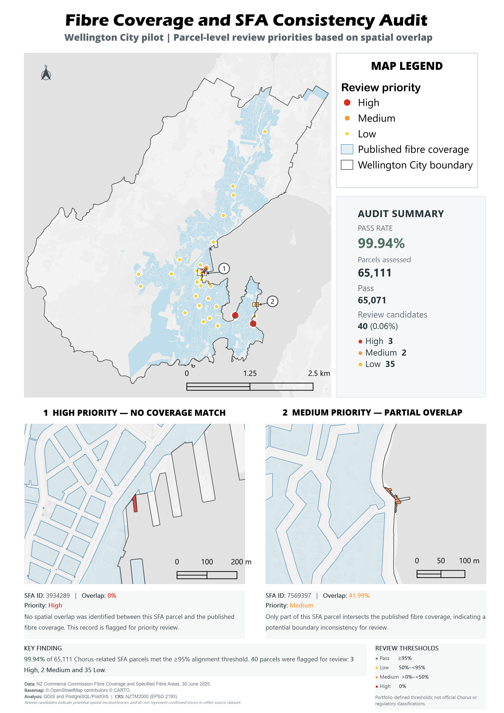

# Fibre-Coverage-SFA-Consistency-Audit-Wellington-Pilot 
- Parcel-level spatial data quality audit using QGIS and PostgreSQL/PostGIS.

A parcel-level spatial data quality audit comparing published Fibre Coverage with Chorus-related Specified Fibre Area (SFA) parcels in Wellington City.

The project demonstrates how QGIS and PostgreSQL/PostGIS can be used to validate geospatial datasets, calculate spatial overlap, identify potential inconsistencies, and translate technical results into operational review priorities.



---

## Project Context

The New Zealand Commerce Commission publishes both:

- **Fibre Coverage** — geographic areas covered by fibre infrastructure.
- **Specified Fibre Areas (SFA)** — parcels formally recognised as having
  access to specified fibre services.

The two datasets serve different purposes and do not contain a common
business key for direct attribute joins.

This creates a useful spatial data quality question:

> **Do Chorus-related SFA parcels spatially align with the published fibre
> coverage extent?**

Because the datasets were published using different reference dates,
identified mismatches are treated as **review candidates rather than
confirmed source-data errors**.

---

## Objective

Build a repeatable GIS workflow to:

1. Extract Chorus-related SFA parcels for Wellington.
2. validate geometry and spatial attributes.
3. compare every SFA parcel with the published Fibre Coverage.
4. calculate parcel-level overlap percentage.
5. classify potential inconsistencies by review priority.
6. produce a clear operational map and summary metrics.

---

## Data

| Dataset | Purpose | Source |
|---|---|---|
| Specified Fibre Areas (SFA) 2025 | Parcel-level fibre service recognition | NZ Commerce Commission |
| Fibre Coverage — 30 Jun 2025 | Published fibre coverage extent | NZ Commerce Commission |
| Territorial Authority 2025 | Wellington City study boundary | Stats NZ |

**Coordinate reference system:** NZGD2000 / New Zealand Transverse Mercator
2000 — EPSG:2193.

The national source datasets contain approximately:

- **1.68 million SFA parcel records**
- **2,008 Fibre Coverage features**

---

## Method

### 1. Study-area preparation

A Wellington City boundary was used for final reporting.

A **500 m study-area buffer** was created for intermediate extraction so
features close to the city boundary were not prematurely truncated.

SFA parcels were extracted by spatial intersection rather than clipping,
preserving their original geometry and parcel area.

Fibre Coverage was clipped to the buffered study area because it represents
a continuous coverage surface rather than cadastral parcels.

### 2. Data quality checks

The workflow included:

- CRS validation
- null-geometry checks
- geometry validity checks
- parcel ID checks
- geometry-derived parcel area calculation
- comparison with source area attributes

All Chorus-related SFA parcels used in the pilot passed the geometry validity
assessment.

### 3. Spatial database optimisation

The analysis was initially tested in QGIS, but parcel-level overlap processing
was moved to PostgreSQL/PostGIS for improved performance.

Optimisation included:

- primary-key indexes
- GiST spatial indexes
- `ANALYZE`
- `ST_Subdivide` on the complex dissolved Fibre Coverage geometry

The subdivided coverage layer contained **2,062 smaller polygon parts**,
reducing unnecessary candidate intersections during spatial processing.

### 4. Parcel-level overlap analysis

For each SFA parcel:

- parcel area was calculated from the validated geometry
- intersection area with Fibre Coverage was calculated
- overlap percentage was derived

The resulting parcel-level dataset retained all SFA records, including parcels
with no coverage intersection.

### 5. Review classification

Overlap results were translated into operational review priorities:

| Review priority | Overlap rule | Interpretation |
|---|---:|---|
| **Pass** | ≥ 95% | Strong spatial alignment |
| **Low** | 50% to <95% | Minor / moderate mismatch for review |
| **Medium** | >0% to <50% | Significant partial overlap |
| **High** | 0% | No published fibre coverage match |

These thresholds were defined for this portfolio demonstration and are not
official Chorus or regulatory classifications.

---

## Results

A total of **65,111 Chorus-related SFA parcels** within the Wellington City
reporting area were assessed.

| Result | Parcels |
|---|---:|
| Pass | **65,071** |
| Review candidates | **40** |
| High | **3** |
| Medium | **2** |
| Low | **35** |

### Key finding

**99.94%** of assessed parcels met the ≥95% alignment threshold.

Only **40 parcels (0.06%)** were identified as review candidates, including:

- **3 High-priority parcels** with no spatial overlap
- **2 Medium-priority parcels** with less than 50% overlap
- **35 Low-priority parcels**

The result indicates a high level of overall spatial consistency while also
identifying a small, targeted set of records suitable for further review.

---

## Example Review Cases

### High Priority — No Coverage Match

- **SFA ID:** 3934289
- **Overlap:** 0%
- **Priority:** High

No spatial overlap was identified between this SFA parcel and the published
fibre coverage. The record was therefore flagged for priority review.

### Medium Priority — Partial Overlap

- **SFA ID:** 7569397
- **Overlap:** 41.99%
- **Priority:** Medium

Only part of this SFA parcel intersects the published fibre coverage,
indicating a potential boundary inconsistency for review.

---

## Tools & Skills Demonstrated

**GIS**
- QGIS
- spatial extraction and clipping
- geometry validation
- thematic mapping
- print layout and reporting

**Spatial Database**
- PostgreSQL
- PostGIS
- spatial SQL
- GiST spatial indexing
- `ST_Intersects`
- `ST_Intersection`
- `ST_Area`
- `ST_Subdivide`

**Data Quality & Reporting**
- geometry QA/QC
- parcel-level data validation
- overlap analysis
- review-priority classification
- operational GIS reporting
- communicating technical results to non-technical users

---

## Key Technical Decisions

### Why preserve complete SFA parcels?

SFA polygons represent individual parcels. Clipping them at the study-area
boundary would modify parcel geometry and area and could distort overlap
percentages.

### Why clip Fibre Coverage?

Fibre Coverage represents a continuous coverage surface. Clipping removes
irrelevant MultiPolygon components outside the study area and reduces
processing overhead.

### Why use PostGIS for overlap processing?

The Wellington pilot contains tens of thousands of parcels and a complex
coverage geometry. PostGIS allowed the workflow to use spatial indexing,
geometry subdivision and SQL-based aggregation more efficiently than the
initial desktop GIS overlap workflow.

---

## Limitations

- Fibre Coverage and SFA datasets represent different publication/reference
  dates.
- Spatial mismatches therefore do not necessarily represent source-data errors.
- Review-priority thresholds were created for this portfolio demonstration.
- Results should be interpreted as **potential review candidates**, not
  confirmed network or regulatory inconsistencies.

---

## Repository Structure

```text
wellington-fibre-sfa-consistency-audit/
│
├── README.md
├── data/
│   └── README.md
│
├── sql/
│   ├── 01_create_indexes.sql
│   ├── 02_subdivide_coverage.sql
│   ├── 03_overlap_analysis.sql
│   └── 04_review_classification.sql
│
├── qgis/
│   └── wellington_fibre_audit.qgz
│
├── outputs/
│   ├── fibre_sfa_consistency_audit_wellington.png
│   └── fibre_sfa_consistency_audit_wellington.pdf
│
└── docs/
    └── workflow_notes.md
